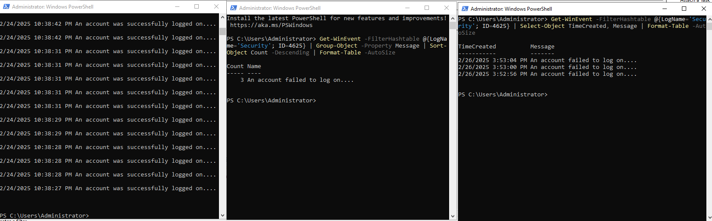
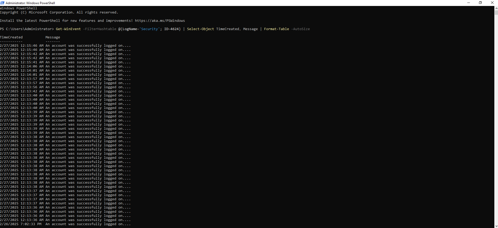
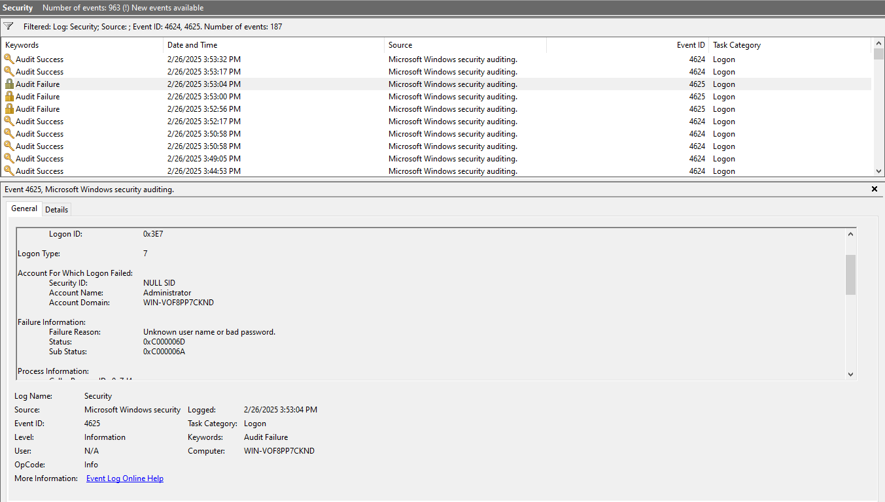
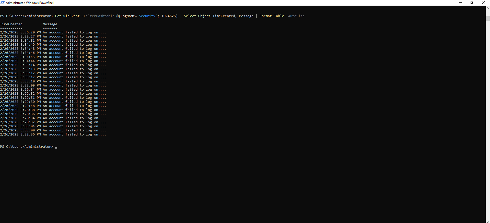
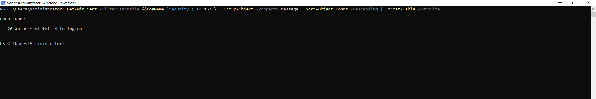

# Windows Login Detection using PowerShell

## 📌 Project Overview
This project demonstrates how to simulate and detect successful and failed login attempts in **Windows Event Logs** using **Windows Event Viewer** and **PowerShell**.

## 🎯 Objectives
- Simulate both **successful and failed login attempts**.
- Detect login events using **Windows Event Viewer**.
- Retrieve and analyze login events using **PowerShell**.
- Identify **potential brute-force attacks**.

## 🛠 Steps
### **Step 1: Simulate Login Events**
1. Lock the machine (`Win + L`) and log in with the correct password. (Generates Event ID **4624**)
2. Lock the machine again and attempt logging in with the wrong password at least **three times** (Generates Event ID **4625**).

### **Step 2: Detect Login Events using Windows Event Viewer**
1. Open **Event Viewer** (`Win + R` → `eventvwr.msc`).
2. Navigate to **Windows Logs → Security**.
3. Filter logs using:
   - **4624** → Successful Logins
   - **4625** → Failed Login Attempts
4. Take screenshots of the logs and save them in the `screenshots/` folder.

### **Step 3: Extract Login Events using PowerShell**
Instead of manually searching, use PowerShell to automate log retrieval:

#### ✅ Check for Successful Logins:
```powershell
Get-WinEvent -FilterHashtable @{LogName='Security'; ID=4624} | Select-Object TimeCreated, Message | Format-Table -AutoSize
```




## ❌ Check for Failed Logins:
```powershell
Get-WinEvent -FilterHashtable @{LogName='Security'; ID=4625} | Select-Object TimeCreated, Message | Format-Table -AutoSize
```


## 🚨 Analyze for Brute-Force Attacks:
```powershell
Get-WinEvent -FilterHashtable @{LogName='Security'; ID=4625} | Group-Object -Property Message | Sort-Object Count -Descending | Format-Table -AutoSize
```


Step 4: Findings & Insights
✅ Successfully simulated successful and failed login attempts.
✅ Extracted and analyzed logs using PowerShell.
✅ Detected potential brute-force attack attempts.

📷 Screenshots
Screenshots of Event Viewer and PowerShell output are available in the screenshots/ folder.

## 📢 Author  
📌 **Nishan Rajmulik**  

🔗 **GitHub:** [nishanrajmulik1](https://github.com/nishanrajmulik1/)  
🔗 **LinkedIn:** [nishanrajmulik](https://linkedin.com/in/nishanrajmulik/)  

